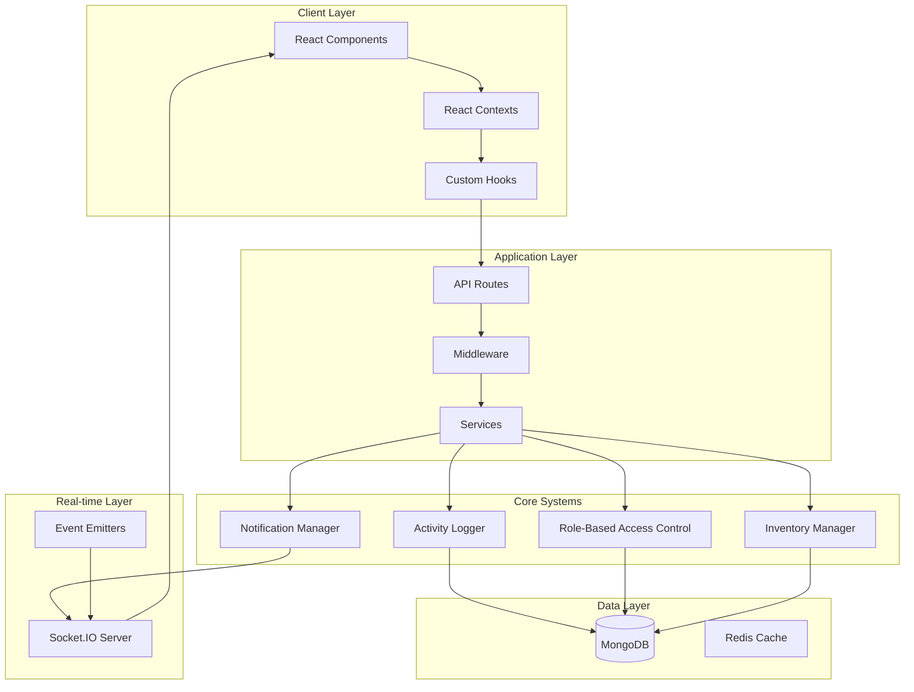

# Design Document

## Overview

The Global Activity Tracking and Data Sharing System is a foundational architecture that provides centralized logging, real-time notifications, role-based data access, and cross-module data synchronization for Account Zero. This system ensures data consistency, maintains audit trails, and enables real-time collaboration across all business modules.

The design leverages existing infrastructure including MongoDB with Prisma ORM, Socket.IO for real-time communication, and React contexts for state management, while introducing new components for activity tracking, notification management, and role-based access control.

## Architecture

### High-Level Architecture



### Component Architecture

The system consists of several interconnected components:

1. **Activity Tracking Service**: Centralized logging of all user actions
2. **Notification Management System**: Real-time notifications and sidebar indicators
3. **Role-Based Access Control**: Dynamic permission management
4. **Central Inventory Pool**: Single source of truth for stock data
5. **Cross-Module Data Synchronization**: Automatic data propagation
6. **Multi-Language Support**: Comprehensive translation system

## Components and Interfaces

### 1. Activity Tracking Service

**Purpose**: Capture, store, and retrieve all user activities across the platform.

**Core Interface**:
```typescript
interface ActivityLog {
  id: string
  userId: string
  module: string
  action: string
  entityType: string
  entityId: string
  entityName: string
  details: Record<string, any>
  timestamp: Date
  ipAddress?: string
  userAgent?: string
}

interface ActivityLogger {
  log(activity: Omit<ActivityLog, 'id' | 'timestamp'>): Promise<void>
  getActivities(filters: ActivityFilters): Promise<ActivityLog[]>
  getActivitiesByRole(userId: string, role: UserRole): Promise<ActivityLog[]>
}
```

**Database Schema Addition**:
```prisma
model ActivityLog {
  id          String   @id @default(auto()) @map("_id") @db.ObjectId
  userId      String   @db.ObjectId
  module      String   // 'inventory', 'sales', 'hr', etc.
  action      String   // 'create', 'update', 'delete', 'approve', etc.
  entityType  String   // 'product', 'customer', 'invoice', etc.
  entityId    String   @db.ObjectId
  entityName  String   // Human-readable name
  details     Json     // Additional context data
  timestamp   DateTime @default(now())
  ipAddress   String?
  userAgent   String?
  
  user        User     @relation(fields: [userId], references: [id])
  
  @@map("activity_logs")
}
```

### 2. Notification Management System

**Purpose**: Handle real-time notifications, sidebar indicators, and management alerts.

**Core Interface**:
```typescript
interface Notification {
  id: string
  userId: string
  type: NotificationType
  title: string
  message: string
  data?: Record<string, any>
  read: boolean
  priority: 'low' | 'medium' | 'high' | 'critical'
  expiresAt?: Date
  createdAt: Date
}

interface NotificationManager {
  create(notification: Omit<Notification, 'id' | 'createdAt'>): Promise<void>
  markAsRead(notificationId: string, userId: string): Promise<void>
  getUnreadCount(userId: string, type?: NotificationType): Promise<number>
  getNotifications(userId: string, filters?: NotificationFilters): Promise<Notification[]>
}
```

**Database Schema Addition**:
```prisma
model Notification {
  id          String           @id @default(auto()) @map("_id") @db.ObjectId
  userId      String           @db.ObjectId
  type        NotificationType
  title       String
  message     String
  data        Json?
  read        Boolean          @default(false)
  priority    NotificationPriority @default(MEDIUM)
  expiresAt   DateTime?
  createdAt   DateTime         @default(now())
  
  user        User             @relation(fields: [userId], references: [id])
  
  @@map("notifications")
}

enum NotificationType {
  ACTIVITY
  INVENTORY_ALERT
  CALENDAR_REMINDER
  MESSAGE
  NOTICE_BOARD
  SYSTEM
}

enum NotificationPriority {
  LOW
  MEDIUM
  HIGH
  CRITICAL
}
```

### 3. Role-Based Access Control System

**Purpose**: Manage dynamic permissions and data access based on user roles and functions.

**Core Interface**:
```typescript
interface Permission {
  module: string
  action: string
  resource?: string
  conditions?: Record<string, any>
}

interface RolePermissions {
  role: UserRole
  permissions: Permission[]
  dataAccess: DataAccessRule[]
}

interface AccessControlManager {
  hasPermission(userId: string, permission: Permission): Promise<boolean>
  getAccessibleData<T>(userId: string, module: string, data: T[]): Promise<T[]>
  getUserPermissions(userId: string): Promise<Permission[]>
}
```

**Enhanced User Role System**:
```prisma
enum UserRole {
  DIRECTOR
  MANAGER
  HOD
  SALES_REP
  INTERNAL_CONSULTANT
  INVENTORY_MANAGER
  HR_STAFF
  ACCOUNTANT
  STAFF_MEMBER
  USER
}

model UserPermission {
  id          String   @id @default(auto()) @map("_id") @db.ObjectId
  userId      String   @db.ObjectId
  module      String
  action      String
  resource    String?
  conditions  Json?
  grantedBy   String   @db.ObjectId
  grantedAt   DateTime @default(now())
  
  user        User     @relation(fields: [userId], references: [id])
  grantor     User     @relation("PermissionGrantor", fields: [grantedBy], references: [id])
  
  @@map("user_permissions")
}
```

### 4. Central Inventory Pool

**Purpose**: Provide single source of truth for all inventory data and movements.

**Core Interface**:
```typescript
interface InventoryPool {
  getAvailableStock(productId: string): Promise<number>
  reserveStock(productId: string, quantity: number, reason: string, userId: string): Promise<string>
  releaseReservation(reservationId: string): Promise<void>
  updateStock(productId: string, change: number, reason: string, userId: string): Promise<void>
  getStockMovements(productId: string, dateRange?: DateRange): Promise<StockMovement[]>
}

interface StockReservation {
  id: string
  productId: string
  quantity: number
  reason: string
  userId: string
  expiresAt: Date
  createdAt: Date
}
```

**Database Schema Additions**:
```prisma
model StockReservation {
  id          String   @id @default(auto()) @map("_id") @db.ObjectId
  productId   String   @db.ObjectId
  quantity    Int
  reason      String
  userId      String   @db.ObjectId
  expiresAt   DateTime
  createdAt   DateTime @default(now())
  
  product     Product  @relation(fields: [productId], references: [id])
  user        User     @relation(fields: [userId], references: [id])
  
  @@map("stock_reservations")
}

model StockMovement {
  id          String           @id @default(auto()) @map("_id") @db.ObjectId
  productId   String           @db.ObjectId
  type        StockMovementType
  quantity    Int
  reason      String
  reference   String?
  userId      String           @db.ObjectId
  beforeQty   Int
  afterQty    Int
  timestamp   DateTime         @default(now())
  
  product     Product          @relation(fields: [productId], references: [id])
  user        User             @relation(fields: [userId], references: [id])
  
  @@map("stock_movements")
}

enum StockMovementType {
  PURCHASE
  SALE
  ADJUSTMENT
  TRANSFER
  RETURN
  DAMAGE
  THEFT
  SPILLAGE
  BREAKAGE
}
```

### 5. Cross-Module Data Synchronization

**Purpose**: Automatically propagate data changes across all relevant modules.

**Core Interface**:
```typescript
interface DataSyncManager {
  registerSyncRule(rule: SyncRule): void
  syncData(sourceModule: string, action: string, data: any): Promise<void>
  getSyncStatus(entityId: string): Promise<SyncStatus>
}

interface SyncRule {
  sourceModule: string
  targetModules: string[]
  trigger: string
  transformer: (data: any) => any
  condition?: (data: any) => boolean
}
```

### 6. Multi-Language Translation System

**Purpose**: Provide comprehensive translation support for all UI components.

**Core Interface**:
```typescript
interface TranslationManager {
  translate(key: string, language: string, params?: Record<string, any>): string
  getTranslations(language: string): Promise<Record<string, string>>
  addTranslation(key: string, translations: Record<string, string>): Promise<void>
}
```

**Translation Storage**:
```prisma
model Translation {
  id          String   @id @default(auto()) @map("_id") @db.ObjectId
  key         String
  language    String   // 'en', 'af', 'zu'
  value       String
  module      String?
  createdAt   DateTime @default(now())
  updatedAt   DateTime @updatedAt
  
  @@unique([key, language])
  @@map("translations")
}
```

## Data Models

### Enhanced User Model Relations
```prisma
model User {
  // ... existing fields ...
  
  // New relations for activity tracking
  activityLogs      ActivityLog[]
  notifications     Notification[]
  permissions       UserPermission[]
  grantedPermissions UserPermission[] @relation("PermissionGrantor")
  stockReservations StockReservation[]
  stockMovements    StockMovement[]
}
```

### Activity Aggregation Views
```typescript
interface DashboardStats {
  totalActivities: number
  recentActivities: ActivityLog[]
  criticalAlerts: number
  pendingApprovals: number
  stockAlerts: StockAlert[]
  upcomingEvents: Event[]
}

interface ModuleStats {
  module: string
  totalTransactions: number
  recentChanges: number
  alerts: number
  lastActivity: Date
}
```

## Error Handling

### Error Categories
1. **Permission Errors**: Access denied, insufficient privileges
2. **Data Consistency Errors**: Sync failures, constraint violations
3. **Inventory Errors**: Insufficient stock, invalid adjustments
4. **Notification Errors**: Delivery failures, invalid recipients
5. **Translation Errors**: Missing keys, invalid languages

### Error Response Format
```typescript
interface ErrorResponse {
  code: string
  message: string
  details?: Record<string, any>
  timestamp: Date
  requestId: string
}
```

### Error Handling Strategy
- All errors are logged to the activity system
- Critical errors trigger immediate notifications to administrators
- User-facing errors are translated to the user's preferred language
- Retry mechanisms for transient failures
- Graceful degradation for non-critical features

## Testing Strategy

### Unit Testing
- **Activity Logger**: Test logging, filtering, and retrieval
- **Notification Manager**: Test creation, delivery, and read status
- **Access Control**: Test permission checks and data filtering
- **Inventory Pool**: Test stock operations and reservations
- **Translation System**: Test key resolution and fallbacks

### Integration Testing
- **Cross-Module Sync**: Test data propagation between modules
- **Real-time Notifications**: Test Socket.IO event delivery
- **Role-Based Access**: Test end-to-end permission enforcement
- **Multi-Language**: Test UI translation across components

### Performance Testing
- **Activity Log Queries**: Test performance with large datasets
- **Real-time Notifications**: Test concurrent user scenarios
- **Inventory Operations**: Test high-frequency stock updates
- **Translation Loading**: Test initial load and caching

### Security Testing
- **Permission Bypass**: Test unauthorized access attempts
- **Data Leakage**: Test cross-tenant data isolation
- **Input Validation**: Test malicious input handling
- **Authentication**: Test session management and token validation

## Implementation Phases

### Phase 1: Core Infrastructure
1. Database schema updates
2. Activity logging service
3. Basic notification system
4. Role-based access control foundation

### Phase 2: Real-time Features
1. Socket.IO integration for notifications
2. Sidebar notification indicators
3. Live activity feeds
4. Real-time inventory updates

### Phase 3: Cross-Module Integration
1. Data synchronization rules
2. Inventory pool implementation
3. Management notification triggers
4. Dashboard statistics aggregation

### Phase 4: User Experience
1. Multi-language translation system
2. Advanced notification preferences
3. Activity filtering and search
4. Mobile-responsive notifications

### Phase 5: Advanced Features
1. Analytics and reporting
2. Audit trail exports
3. Advanced permission management
4. Performance optimization