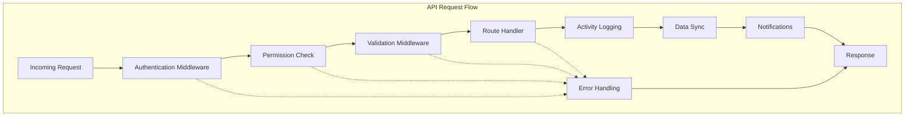

# API Middleware Documentation

This document describes the comprehensive middleware system implemented for Account Zero's API routes, providing authentication, activity logging, notifications, data synchronization, and error handling.

## Overview

The API middleware system provides a unified approach to handling cross-cutting concerns across all API endpoints. It integrates the following components:

- **Authentication & Authorization**: Role-based access control with permission checking
- **Activity Logging**: Automatic logging of all user actions for audit trails
- **Real-time Notifications**: Automatic notification triggers for business events
- **Data Synchronization**: Cross-module data propagation
- **Error Handling**: Consistent error responses with translation support
- **Request Validation**: Schema-based validation with translated error messages

## Architecture



## Middleware Components

### 1. Authentication Middleware

Handles user authentication and attaches user information to requests.

**Features:**
- JWT token validation
- User session management
- Role-based access control
- Permission checking

**Usage:**
```typescript
import { withAuth, withPermission, withRole } from '@/lib/middleware/auth-middleware'

// Basic authentication
export const GET = withAuth(async (req: AuthenticatedRequest) => {
  // req.user is available here
  return NextResponse.json({ user: req.user })
})

// Permission-based access
export const POST = withPermission(PERMISSIONS.SALES_CREATE, async (req) => {
  // Only users with sales create permission can access
})

// Role-based access
export const DELETE = withRole([UserRole.DIRECTOR, UserRole.MANAGER], async (req) => {
  // Only directors and managers can access
})
```

### 2. Activity Logging Middleware

Automatically logs all user actions for audit trails and compliance.

**Features:**
- Automatic CRUD operation logging
- IP address and user agent tracking
- Contextual information capture
- Role-based activity filtering

**Logged Information:**
- User ID and details
- Module and action type
- Entity type and ID
- Timestamp and IP address
- Request details and changes

### 3. Notification Middleware

Triggers real-time notifications based on business events.

**Features:**
- Conditional notification triggers
- Role-based targeting
- Priority-based delivery
- Real-time Socket.IO broadcasting

**Example Triggers:**
- Large transactions (>R10,000)
- Low stock alerts
- New customer registrations
- System setting changes

### 4. Data Synchronization Middleware

Ensures data consistency across modules through automatic propagation.

**Features:**
- Cross-module data updates
- Event-driven synchronization
- Conflict resolution
- Sync status tracking

### 5. Error Handling Middleware

Provides consistent error responses with translation support.

**Features:**
- Database error translation
- Localized error messages
- Structured error responses
- Error logging and monitoring

## Predefined Configurations

The system provides predefined middleware configurations for common use cases:

### PUBLIC
- **Authentication**: Not required
- **Activity Logging**: Disabled
- **Data Sync**: Disabled
- **Use Cases**: Health checks, public endpoints

### AUTHENTICATED
- **Authentication**: Required
- **Activity Logging**: Enabled
- **Data Sync**: Enabled
- **Use Cases**: Basic user endpoints

### ADMIN_ONLY
- **Authentication**: Required (Director/Manager roles)
- **Activity Logging**: Enabled
- **Data Sync**: Enabled
- **Use Cases**: Administrative functions

### SALES
- **Authentication**: Required (Sales permission)
- **Activity Logging**: Enabled (sales module)
- **Data Sync**: Enabled
- **Notifications**: Large transaction alerts
- **Use Cases**: Sales and invoicing endpoints

### INVENTORY
- **Authentication**: Required (Inventory permission)
- **Activity Logging**: Enabled (inventory module)
- **Data Sync**: Enabled
- **Notifications**: Low stock alerts
- **Use Cases**: Product and stock management

### CUSTOMERS
- **Authentication**: Required (Customer permission)
- **Activity Logging**: Enabled (customers module)
- **Data Sync**: Enabled
- **Notifications**: New customer alerts
- **Use Cases**: Customer management endpoints

### SETTINGS
- **Authentication**: Required (Settings permission)
- **Activity Logging**: Enabled (settings module)
- **Data Sync**: Enabled
- **Notifications**: System change alerts
- **Use Cases**: System configuration endpoints

## Implementation Guide

### Quick Migration

For existing routes, use the `quickMigrate` helper:

```typescript
import { quickMigrate, COMMON_NOTIFICATIONS } from '@/lib/middleware/route-migrator'
import { AuthenticatedRequest } from '@/lib/middleware/auth-middleware'

async function handleGET(request: AuthenticatedRequest) {
  // Your existing logic here
  // req.user is automatically available
}

async function handlePOST(request: AuthenticatedRequest) {
  // Your existing logic here
  // Errors are automatically handled by middleware
}

// Apply middleware
const { GET, POST } = quickMigrate('sales', {
  GET: handleGET,
  POST: handlePOST
}, {
  notifications: {
    triggers: [COMMON_NOTIFICATIONS.largeTransaction(10000)]
  }
})

export { GET, POST }
```

### Custom Configuration

For advanced use cases, use the full middleware composer:

```typescript
import { withApiMiddleware } from '@/lib/middleware/api-middleware'
import { PERMISSIONS } from '@/lib/middleware/auth-middleware'

const customConfig = {
  auth: {
    required: true,
    permission: PERMISSIONS.INVENTORY_UPDATE
  },
  activity: {
    module: 'inventory',
    entityType: 'product'
  },
  sync: { enabled: true },
  notifications: {
    triggers: [
      {
        condition: (req, response) => response?.product?.quantity <= 0,
        type: NotificationType.INVENTORY_ALERT,
        priority: NotificationPriority.CRITICAL,
        title: 'Stock Depleted',
        message: 'Product is now out of stock',
        targetRoles: [UserRole.INVENTORY_MANAGER, UserRole.MANAGER]
      }
    ]
  }
}

export const PUT = withApiMiddleware(async (req: AuthenticatedRequest) => {
  // Your handler logic
}, customConfig)
```

## Route Documentation

### Authentication Routes
- `POST /api/auth/login` - **PUBLIC** - User login
- `POST /api/auth/signup` - **PUBLIC** - User registration
- `POST /api/auth/logout` - **AUTHENTICATED** - User logout

### Customer Management
- `GET /api/customers` - **CUSTOMERS** - List customers
- `POST /api/customers` - **CUSTOMERS** - Create customer (triggers new customer notification)
- `PUT /api/customers/[id]` - **CUSTOMERS** - Update customer
- `DELETE /api/customers/[id]` - **ADMIN_ONLY** - Delete customer

### Inventory Management
- `GET /api/inventory/products` - **INVENTORY** - List products
- `POST /api/inventory/products` - **INVENTORY** - Create product
- `PUT /api/inventory/products/[id]` - **INVENTORY** - Update product (triggers low stock alerts)
- `DELETE /api/inventory/products/[id]` - **ADMIN_ONLY** - Delete product

### Sales Management
- `GET /api/sales` - **SALES** - List sales
- `POST /api/sales` - **SALES** - Create sale (triggers large transaction alerts)
- `PUT /api/sales/[id]` - **SALES** - Update sale
- `DELETE /api/sales/[id]` - **ADMIN_ONLY** - Delete sale

### System Settings
- `GET /api/settings/company` - **SETTINGS** - Get company settings
- `PUT /api/settings/company` - **SETTINGS** - Update company settings (triggers system change alerts)

### User Management
- `GET /api/users` - **ADMIN_ONLY** - List users
- `POST /api/users` - **ADMIN_ONLY** - Create user
- `PUT /api/users/[id]` - **ADMIN_ONLY** - Update user
- `DELETE /api/users/[id]` - **ADMIN_ONLY** - Delete user

## Error Responses

All API endpoints return consistent error responses:

```json
{
  "error": "Translated error message",
  "code": "ERROR_CODE",
  "timestamp": "2024-01-01T00:00:00.000Z",
  "details": {
    "field": "Additional error details"
  }
}
```

### Common Error Codes
- `401` - Authentication required
- `403` - Insufficient permissions
- `404` - Resource not found
- `409` - Duplicate entry (Prisma P2002)
- `422` - Validation failed
- `500` - Internal server error

## Notification Types

The system supports the following notification types:

- `ACTIVITY` - User activity notifications
- `INVENTORY_ALERT` - Stock level alerts
- `CALENDAR_REMINDER` - Calendar event reminders
- `MESSAGE` - Direct messages
- `NOTICE_BOARD` - Notice board updates
- `SYSTEM` - System-wide notifications

## Activity Logging

All authenticated actions are automatically logged with the following information:

```json
{
  "id": "activity_id",
  "userId": "user_id",
  "module": "sales",
  "action": "create",
  "entityType": "sale",
  "entityId": "sale_id",
  "entityName": "Sale #12345",
  "details": {
    "method": "POST",
    "changes": { "total": 1500.00 }
  },
  "timestamp": "2024-01-01T00:00:00.000Z",
  "ipAddress": "192.168.1.1",
  "userAgent": "Mozilla/5.0..."
}
```

## Testing

The middleware system includes comprehensive test coverage:

```bash
# Run middleware tests
npm test src/lib/middleware

# Run integration tests
npm test src/lib/middleware/__tests__/api-middleware.integration.test.ts

# Run specific middleware component tests
npm test src/lib/middleware/__tests__/auth-middleware.test.ts
npm test src/lib/middleware/__tests__/activity-middleware.test.ts
```

## Migration Tools

Use the provided migration script to update existing routes:

```bash
# Dry run to see what would be changed
npx tsx scripts/migrate-api-routes.ts --dry-run

# Migrate all routes
npx tsx scripts/migrate-api-routes.ts

# Migrate specific route
npx tsx scripts/migrate-api-routes.ts --route=customers

# Generate documentation
npx tsx scripts/migrate-api-routes.ts --docs
```

## Performance Considerations

- **Caching**: Permissions and translations are cached for performance
- **Async Operations**: Notifications and sync operations are non-blocking
- **Database Indexing**: Activity logs and notifications have proper indexes
- **Error Handling**: Graceful degradation for non-critical features

## Security Features

- **Role-based Access Control**: Granular permission system
- **Input Validation**: Schema-based request validation
- **Audit Trails**: Complete activity logging
- **Error Sanitization**: Sensitive information is not exposed
- **Rate Limiting**: Built-in rate limiting support

## Monitoring and Observability

- **Activity Logs**: Complete audit trail of all actions
- **Error Tracking**: Structured error logging
- **Performance Metrics**: Request timing and success rates
- **Notification Delivery**: Tracking of notification success/failure
- **Sync Status**: Data synchronization monitoring